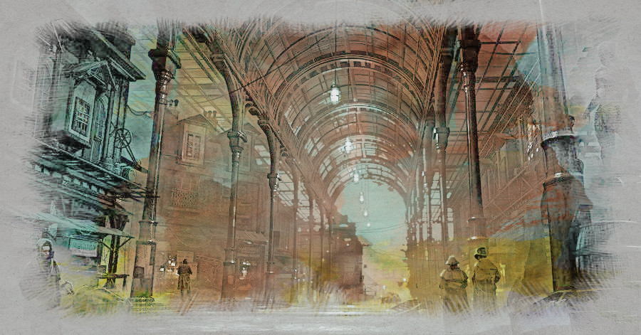
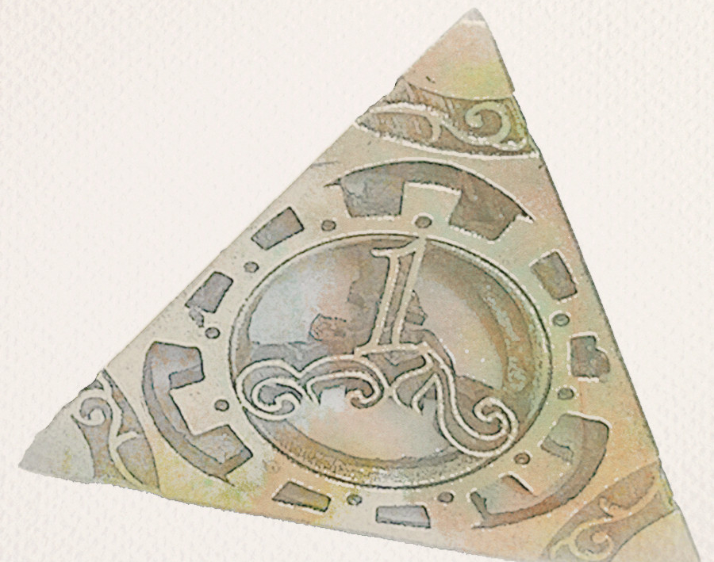
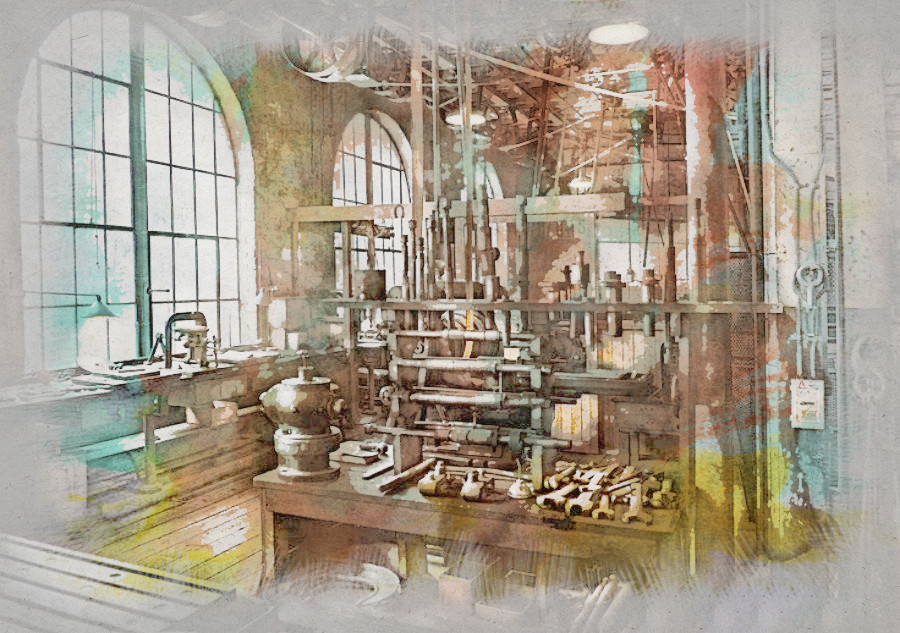

_This first session of Ultraviolet Grasslands using Cypher System started off well enough, after a few weeks of planning and a Session Zero that built the characters, but fell flat when the GM (me) was hit by a power cut and lost all network connectivity other than Discord on my cellphone. But hey, these things are sent to make us stronger. The second session went a little better, so here's the write-up for both._

## Our Heroes

**Aberama Gold** is a Violet City doghead inquisitor. He came to the Violet City some time ago by ship from across the Circle Sea and now works for the noble cats of the Violet Citadel (he knows the cats are the real lords). He wields the power of the Purple Goddess and hunts for doghead insurrectionists in and around the city. Aberama has spent some time out in the Purple Land of the Cat hunting his quarry, but he's recently heard portents of a deadly machine demon who might be able to overthrow his masters.

**Leo** is an adept, fresh to the Violet City, having come here to find new magicks for his master. He's heard about caravans to the Grasslands and is interested in joining one to further his quest.

**Pascale** is a lyrical accountant, a number cruncher who specializes in creating poetic ledgers that embody subjective beauty and emotional truth as well as being numerically accurate. Her life is driven by her abacus, which somehow shows a new number at the start of every day, a number which often dictates or at least provides the basis for Pascal's actions that day. Today, Pascale's abacus reads **632**.

## Prolog

In the Grasslands, beyond the **Dead Bridge** somewhere along the **Dark Light Path**, a lone figure walks, hunched over and shrouded in black; it stumbles as if fighting against an unseen wind to move forward. Pausing, the figure reaches into its robes and pulls out an **Oldtech** device. The device glows green and speaks in a soft voice. The figure walks forward again, its progress unhindered.

Later as the sun drops below the purple haze on the horizon, the figure arrives at the mouth of a cave, pausing for a second before walking inside.

Deep within the rock lies a cathedral to the Oldtech gods, at its centre the body of the machine lies dormant, silent, waiting for command. The figure takes out the Oldtech device and speaks to it. The device glows again, **Vomish** runes dancing across its surface as it whispers back in that same soft voice.

"Initiate!" the figure shouts, gesturing with one hand in space as glowing circuits form in the air, and the machine responds with a pulse of energy that throws the figure off its feet, the Oldtech device dies with a whimper. The figure is motionless.

Somewhere else in the grasslands, carved high on sapphire cliffs lies the **Face of the Blue God**. Startled, its eyes snap open.

Aberama Gold wakes in a cold sweat.

## The Story Begins

Afternoon in the **Violet City** is a complicated affair. Like cities of the **Before Times**, the Violet City never sleeps, but its level of wakefulness does change as the day rolls by, in particular when the purple haze of the cocktail hour arrives. The sounds and smells of the city seem somehow more restrained, and the tendencies of some folks lean towards contemplation, siesta and coffee.

It is at this time we find our Heroes (capital H), gathering in **The Under-Dog Cafe** in the **Charger's Ward** of the city. Sure, the city is ruled by the ever-present **Cat Lords**, but that doesn't mean there isn't room for the odd, illicit establishment serving Dog Coffee instead of the ubiquitous Cat Coffee.

In this case, the Under-Dog is in this modest commercial district, not far from the **Marut**, an ancient stone colossus of unweathered stone, where local merchants come to make contracts (it is said that anyone who breaks an oath sworn upon the Marut will be slain before the next dawn. Probably not true, but then who would dare find out the hard way).

Outside, as the shadow of **The Shrine of Georguy** (a stone niche enshrining the holy symbol of Georguy, Lord of Protection, said to reveal visions to those who leave an offering) falls across the basement windows of the cafe, our Heroes (capital H) are deep in conversation...

## The Under-Dog

Aberama and Leo get to talking about heading out into the grasslands, and how difficult it can be to finance & build a caravan. From a nearby table, a young lady pipes up "It's not that hard, it's all about the numbers you see." and Pascale joins the conversation.

Together, they decide that for their first venture into the wilds it would be best to find an existing caravan and see if they can hire-on to the crew - less risky, and not as financially taxing (despite Pascale's observations to the contrary).

Having no luck finding anything suitable from the piles of notes Leo had ripped off noticeboards around the ward, our Heroes (capital H) decide to call it a day. Pascale & Leo are staying in temporary lodgings, so Aberama volunteers his small apartment as a home for the night so that they can save their dwindling funds.

## The Covered Market

Leaving the Under-Dog Cafe, our Heroes head for Aberama's apartment through the covered market.

{}

They travel but a few tens of yards when a figure steps from behind a pillar, a tall woman dressed in leather and metal with strange glyphs tattooed on her face, and calls "Leo!", then as they stop "You'll never find it! Your old Master, Sire Lemtep was a fool to entrust the search to you!"

"I'm sorry," Leo looked confused, "Do I know you?"

"So you're a fool as well. Kill them, kill them all!"

From behind nearby boxes and pillars, four figures dressed in black leather and wearing ancient **biochemtech** masks step into the light and move menacingly forward.

In the ensuing struggle, Aberama takes a pistol shot to the chest that staggers and bruises him, but the stoic inquisitor recovers enough to take down the woman in leather & metal and two of the thugs with his crossbow &  halberd.

Pascale momentarily confuses one with a simple "Hello, how can I help you?", which gives her time to raise her **Resonance Field** in defence and prepare her abacus' and **Onslaught** for battle. A combination of the two over the next few minutes are enough to lay that thug down.

Leo raises his **Ward** for defence and makes short work of the last thug with his **Onslaught**.

Searching for clues to the identity of the woman in leather & metal, Aberama finds two **small metallic tetrahedra** with what looks like micro-circuitry engraved on three faces and strange markings on the fourth. He pockets the curiosities, having no idea what they are.

{{% figure src="../oldtech_device_d4.jpg" width="30%" %}}

Exhausted from the fight, our Heroes resume their journey to Aberama's apartment and well-deserved rest.

## Finding A Caravan

The next day, after a long and depressingly unproductive search for a potential caravan to join, on a nearby notice board our Heroes see word of a caravan of six dwarves heading into the Grasslands, bound for Potsherd Crater to scout for caches of old tech for their recycling business. The caravan will use three mules and two guzzolene walkers.

Six dwarves, three mules, two walkers. 6-3-2. Pascale's eyes light up - the numbers from her abacus![^1]. This must be a sign.

Our Heroes head to the nearby industrial district where they find a workshop unit, a hand-painted sign with **Hog Enterprises** hanging over the roller-shutter door, and two dwarves hard at work within.

{}

"Not open yet!" the shorter dwarf hollers past the stogie stuck in his mouth.

"We're here about the ad," says Aberama, "for the caravan."

"We ain't got much room for passengers, and we're only heading as far as Potsherd Crater. We can maybe make space for you for about 500&euro; a week."

"No, we want to sign-on to work. I've got this halberd I can swing, Pascale here is good with numbers and Leo, what **do** you do, Leo?"

A short time later, a bargain has been struck. Our Heroes (capital H) will sign on as guard, accountant and ambassador/magic consultant for the group at a pay of 50&euro; per week.

The larger of the two dwarves, who our Heroes now know to be **Nezod Smeltgut** spits in his palm and offers it to acknowledge the bargain.

"It'll take us a few days to get the walkers ready; be back here before sunrise on the second day of Redmonth. Bring yer own chattels, no more than one sack - we ain't got space for anything more. We'll head out past the **Marut** to hallow the contract and be on our way to the 'lands well before noontime"

And with a bargain struck, our Heroes head off to plan for their adventure.

[^1]: The dialog was more "Six dwarves, three mules, two walkers, Pascale."  "What?" "Six dwarves, three mules, two walkers." "Yeah, I know, I heard you." "Six, three and two." "OK, so?" "632" "Uh, OK?" "What number did your abacus say this morning?" "Six three t... OH!"